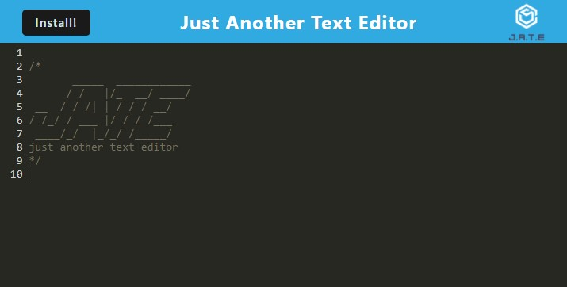

# text-editor

A single-page PWA - a text editor - that runs in the browser, even when offline

## Table of Contents

- [Installation](#installation)
- [Usage](#usage)
- [Credits](#credits)
- [License](#license)

## Installation

1. Clone [this repository](https://github.com/ndallich1/text-editor) in your terminal and navigate locally to the repo.
2. Type `npm i` in your terminal to install dependencies from the root
3. Navigate into the client folder by typing `cd client`
4. Type `npm i` to install dependencies in the client folder
5. Navigate back to the root directory by typing `cd ../`
6. Type `npm i` to install dependencies in the server folder
7. Navigate back to the root directory by typing `cd ../`
8. Start the application in your terminal by typing `npm start`

## Usage

To navigate to the web application in your browser, click [here](https://blooming-forest-34438.herokuapp.com/)

You can even install this progressive web app in your browser by clicking the "Install!" button on the top left of the page. 

## Credits

Assists on bug-fixing from the developer below:

[Tommy Newnum](https://github.com/tnewnum)

## License

MIT License

Copyright 2023 Nikki Dallich

Permission is hereby granted, free of charge, to any person obtaining a copy of this software and associated documentation files (the "Software"), to deal in the Software without restriction, including without limitation the rights to use, copy, modify, merge, publish, distribute, sublicense, and/or sell copies of the Software, and to permit persons to whom the Software is furnished to do so, subject to the following conditions:

The above copyright notice and this permission notice shall be included in all copies or substantial portions of the Software.

THE SOFTWARE IS PROVIDED "AS IS", WITHOUT WARRANTY OF ANY KIND, EXPRESS OR IMPLIED, INCLUDING BUT NOT LIMITED TO THE WARRANTIES OF MERCHANTABILITY, FITNESS FOR A PARTICULAR PURPOSE AND NONINFRINGEMENT. IN NO EVENT SHALL THE AUTHORS OR COPYRIGHT HOLDERS BE LIABLE FOR ANY CLAIM, DAMAGES OR OTHER LIABILITY, WHETHER IN AN ACTION OF CONTRACT, TORT OR OTHERWISE, ARISING FROM, OUT OF OR IN CONNECTION WITH THE SOFTWARE OR THE USE OR OTHER DEALINGS IN THE SOFTWARE.

## Questions

If you have any questions, please feel free to email me at ndallich@gmail.com.
